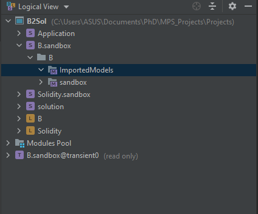
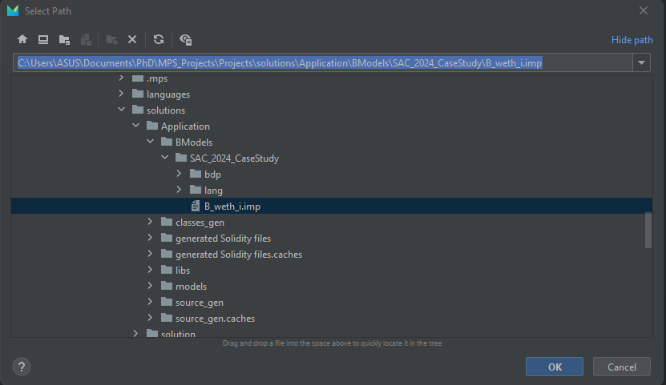

# B2Sol Project

The B2Sol project is a translation prototype tool designed to generate Solidity smart contracts from specific B models. This tool leverages Antlr4, Eclipse Java 8, and JetBrains MPS version 2020.3.6 to provide this functionality.

## Testing the Project

### Phase 1: Setting Up the Tool

1. Download MPS 2020.3.6 from [here](https://www.jetbrains.com/mps/download/previous.html).
2. Clone the project through MPS IDE following these steps: [Cloning a Repository in MPS](https://www.jetbrains.com/help/mps/cloning-repository.html#clone_project_from_welcome_screen).
3. Open the project and import the following modules:
   - Right-click on the project "<i>B2Sol</i>" and select the option "<i>Project Modules</i>".
   - Import the modules listed below:
     - MPS_Projects/Projects/languages/B/B.mpl
     - MPS_Projects/Projects/languages/B/sandbox/B.sandbox.msd
     - MPS_Projects/Projects/languages/Solidity/Solidity.mpl
     - MPS_Projects/Projects/solutions/Application/Application.msd
     - MPS_Projects/Projects/solutions/solution/solution.msd
4. Rebuild the B and Solidity languages: Right-click on a language and select "<i>Rebuild Language...</i>", and then rebuild the entire project: Right-click on the project and select "<i>Rebuild Project</i>".

### Phase 2: Translation Test

1. In the MPS IDE, right-click on the folder "<i>ImportedModels</i>" located in "<i>B.sandbox > B </i>" and select the first option "<i>Import B Model...</i>".
    

    
   

2. Select the B project implementation file "<i>B_weth_i.imp</i>" in the folder "<i>Project > solution > Application > BModels > SAC_2024_CaseStudy</i>".
    

   
   

3. A transient B model will be created in the folder "<i>ImportedModels</i>". This model displays the elements selected from the B project that are essential for the translation.
4. To generate the Solidity code, right-click on the generated model and select "<i>Preview Generated Text</i>".
5. For testing the Solidity code, you can use the [Remix IDE](https://remix.ethereum.org/), which provides an Ethereum Blockchain simulator to deploy the Solidity code and interact with it.
